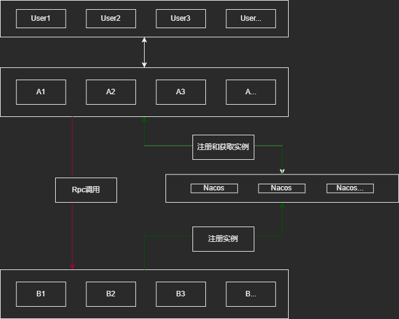

# RocketCat


## 介绍

<p align="center">

</p>

- 2022/10/14
- 目前还是一个实验性项目
- 还需要很多要完成的东西
- **注意:此文档某些代码的Api已经变化了**

### 起步

- 安装后复制下列代码即可运行.
- go get github.com/licheng1013/rocket-cat

```go
package main

import (
	"github.com/gorilla/websocket"
	"github.com/licheng1013/rocket-cat/common"
	"github.com/licheng1013/rocket-cat/connect"
	"github.com/licheng1013/rocket-cat/core"
	"github.com/licheng1013/rocket-cat/decoder"
	"github.com/licheng1013/rocket-cat/messages"
	"github.com/licheng1013/rocket-cat/router"
	"log"
	"net/url"
	"os"
	"os/signal"
	"time"
)

func main() {
	socket := &connect.WebSocket{}
	channel := make(chan int)
	gateway := core.NewGateway()
	gateway.SetDecoder(decoder.JsonDecoder{})
	gateway.Router().AddAction(common.CmdKit.GetMerge(1, 1), func(ctx *router.Context) {
		socket.SendMessage(ctx.Message.SetBody([]byte("Hi")).GetBytesResult())
		ctx.Message.SetBody([]byte("Hi Ok 2"))
	})
	go gateway.Start(connect.Addr, socket)
	time.Sleep(time.Second / 2) //等待完全启动
	go WsTest(channel)
	select {
	case ok := <-channel:
		log.Println(ok)
	}
}

func WsTest(v chan int) {
	interrupt := make(chan os.Signal, 1)
	signal.Notify(interrupt, os.Interrupt)
	u := url.URL{Scheme: "ws", Host: connect.Addr, Path: "/ws"}
	log.Printf("connecting to %s", u.String())

	c, _, err := websocket.DefaultDialer.Dial(u.String(), nil)
	if err != nil {
		log.Fatal("dial:", err)
	}
	defer c.Close()
	done := make(chan struct{})
	var count int64
	go func() {
		defer close(done)
		for {
			_, m, err := c.ReadMessage()
			jsonDecoder := decoder.JsonDecoder{}
			dto := jsonDecoder.DecoderBytes(m)
			if err != nil {
				log.Println("读取消息错误:", err)
				return
			}
			log.Println("收到消息:", string(dto.GetBody()))
			count++
			if count >= 2 {
				v <- 0
			}
		}
	}()
	for {
		jsonMessage := messages.JsonMessage{Body: []byte("HelloWorld")}
		jsonMessage.Merge = common.CmdKit.GetMerge(1, 1)
		err := c.WriteMessage(websocket.TextMessage, jsonMessage.GetBytesResult())
		if err != nil {
			log.Println("写:", err)
			return
		}
	}
}

```

### 描述

- 一个go简单游戏服务器实现，目前是的。
- 打造一个简单的游戏服务器框架，易扩展，易使用。
- 网关与逻辑服通过Grpc进行调用
- 框架大部分功能都可以重写覆盖掉，自定义非常容易。

### 架构图

- 从架构图可以看出从A获取B的地址是从通过注册中心**Nacos**获取的,当然你也可以自定义其他注册中心。
- 注:单机模式-不需要nacos即可使用
- 

## 功能

- [X] 广播支持websocket.
- [X] 自定义底层连接.
- [X] 支持中间件.
- [X] 单机模式.
- [X] 自定义远程通信.
- [X] 网关支持kcp,websocket,tcp.
- [X] 负载均衡-由注册中心提供.
- [X] 逻辑服互调功能.
- [X] 传输协议json,proto

- 下面介绍一些功能的说明

### 中间件

- 在调用目标路由方法之前或之后处理一些自定义逻辑,需要实现 Proxy 接口
- 以下为示例。

```go
// ProxyFunc 代理模型
type ProxyFunc struct {
	proxy Proxy
}

func (p *ProxyFunc) InvokeFunc(ctx Context) []byte {
	// 之前逻辑
	return p.proxy.InvokeFunc(ctx)
	// 之后逻辑
}

func (p *ProxyFunc) SetProxy(proxy Proxy) {
	p.proxy = proxy
}
```

### 逻辑服互调功能


- 用于解决逻辑服与网关服直接的互相调用问题
- **举例1**
- - 框架制作了一个登入插件,用于解决登入问题(当然你也可以重写一个)
- - 当用户在分布式环境下的调用链路是
- "->" 表示请求并返回数据
- - 用户 -> 网关 -> 逻辑服 
- - 我们知道用户和网关建立了连接，但逻辑服并不知道
- - 但我们的业务都是写在逻辑服当中的
- - 那登入操作就需要，再次调用网关中的逻辑
- - 用户 -> 网关 -> 逻辑服 -> 网关
- - 以执行某些逻辑。例如: 登入或者所有在线用户等等
- **举例2**
- - 上面描述了逻辑服调用网关服
- - 那有时候我们想调用所有逻辑服怎么办？
- - 当然框架也为我们封装好了。
- - 例如: 执行n个逻辑服的方法。前体需要注册到路由里面去即可。


- **注意**: 登入插件你也可以根据需要选择在多集群redis或者其他中间件实现


### 自定义底层链接

- 网关服与逻辑服是通过Grpc进行调用的
- 网关服与客户端是通过长连接进行调用的。
- 以上我们提供了统一接口方法，你可以自定义自己的连接进行使用
- 也就是说无论你何时都可以进行优化他，改进他。

### 单机模式

- 单机模式与集群模式的区别在于
- 集群模式下需要另外配置一些参数即可使用,但也是在单机模式上进行扩展
- 也就是说，你在单机模式开发完之后微调一下在切换到集群模式也可以的
- 这样就只需要启动一个进程


### 负载均衡

- 逻辑服的负载均衡取决你使用的注册中心
- 目前框架所配置的参数为单机的nacos
- 不过你可以重写他，来实现自己获取逻辑服ip的逻辑
- 当然这也是调用其他业务服的功能